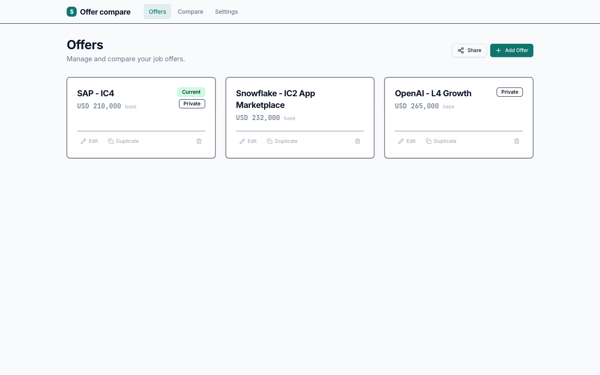
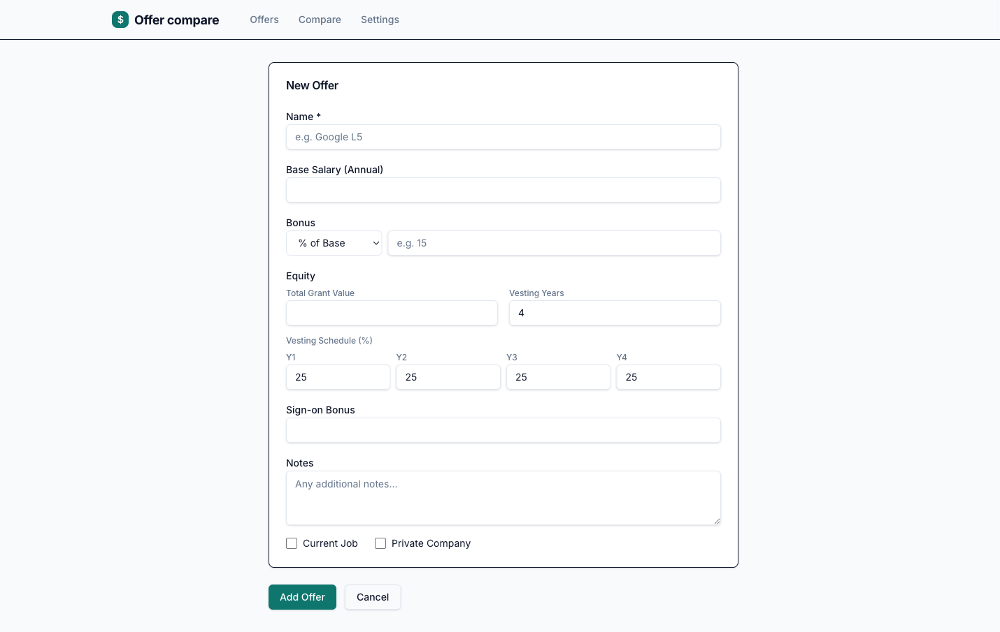
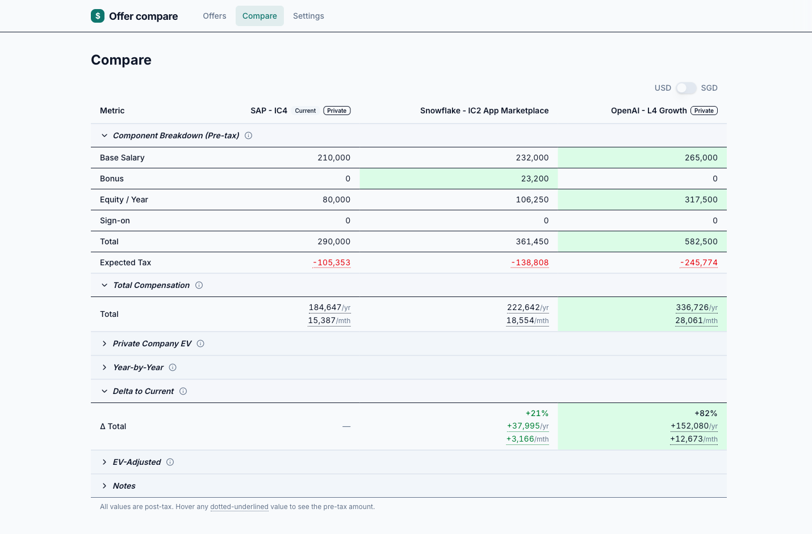
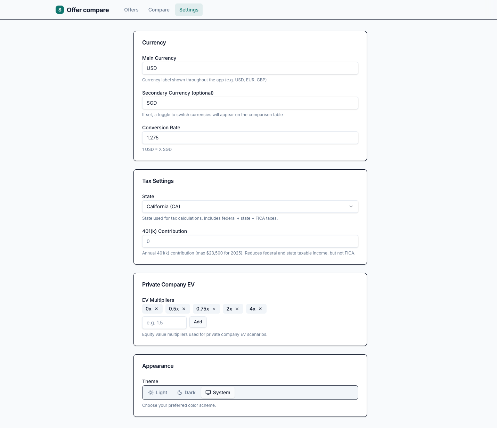

# Offer Compare

> Try at [offer-compare.vercel.app](offer-compare.vercel.app)

Offer Compare is a local-first web app for evaluating job offers by **estimated take-home pay**, not just headline total comp.

It models base, bonus, equity vesting, sign-on, taxes (federal + state + FICA), and private-company equity EV scenarios so you can compare offers side-by-side.

## What It Does

- Create and manage multiple offers (salary, bonus, equity grant, vesting, sign-on, notes).
- Compare pre-tax and estimated after-tax compensation in a single table.
- See deltas versus your current role and year-by-year vesting impact.
- Model private-company equity with configurable EV multipliers.
- Toggle between two currencies for quick cross-market comparisons.
- Share/import full scenarios via compressed URL links.
- Keep data in-browser (no backend required).

## Screenshots

### Offers


### Add Offer


### Comparison Table


### Settings


## Quick Start

```bash
npm install
npm run dev
```

App runs at `http://localhost:5173`.

## Docker

```bash
docker build -t offer-compare .
docker run -e REPLICA_ID=replica-a -p 8080:80 offer-compare
```

App runs at `http://localhost:8080`.

## Tax Data Updates

Tax constants live in `src/lib/tax-brackets.ts` and should be refreshed yearly:

- Federal brackets and standard deduction (IRS inflation updates)
- FICA wage base (SSA annual update)
- 401(k) contribution limit (IRS annual notice)
- State brackets in `STATE_TAX_DATA`

## Current Assumptions

- Single filer calculations
- Federal standard deduction applied
- 401(k) lowers federal/state taxable income, not FICA wages
- Equity is treated as ordinary income at vest
- No capital gains modeling
